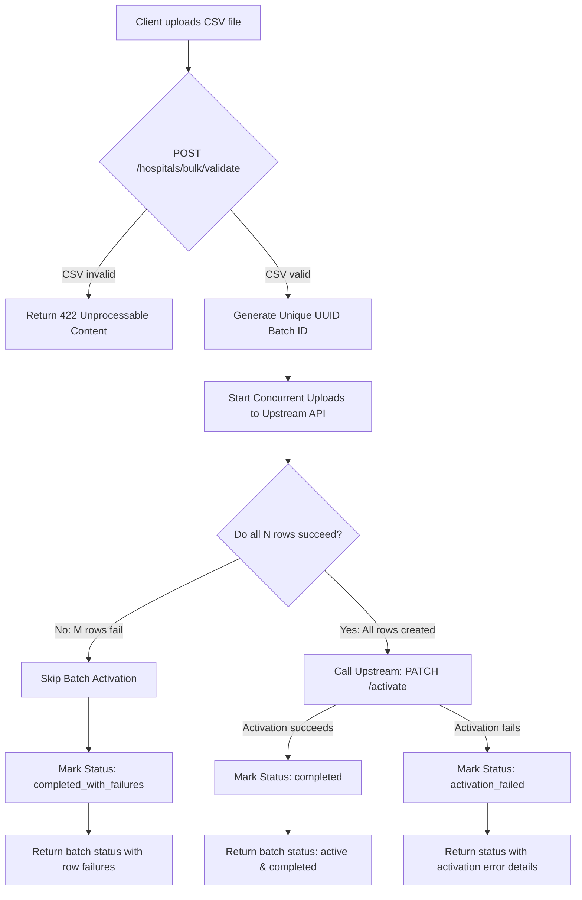
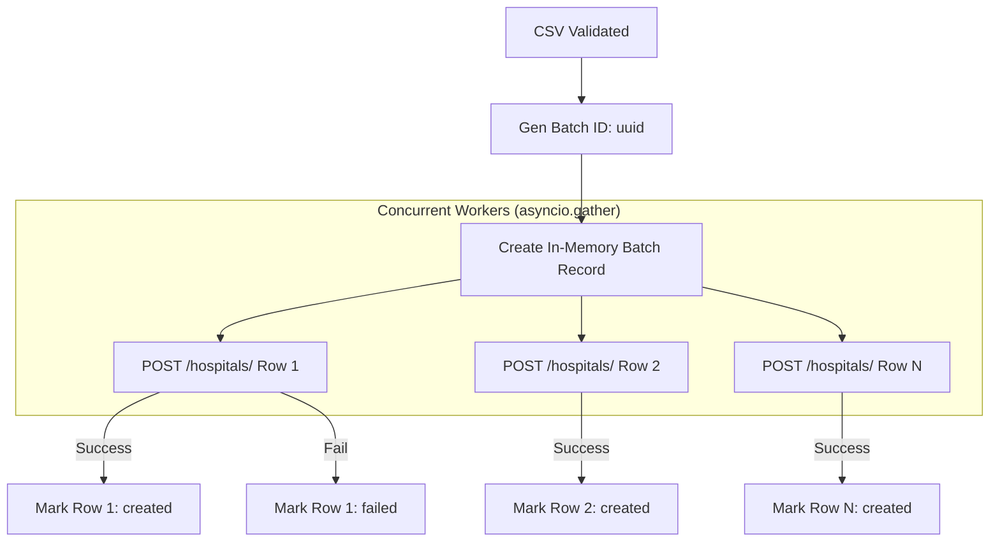
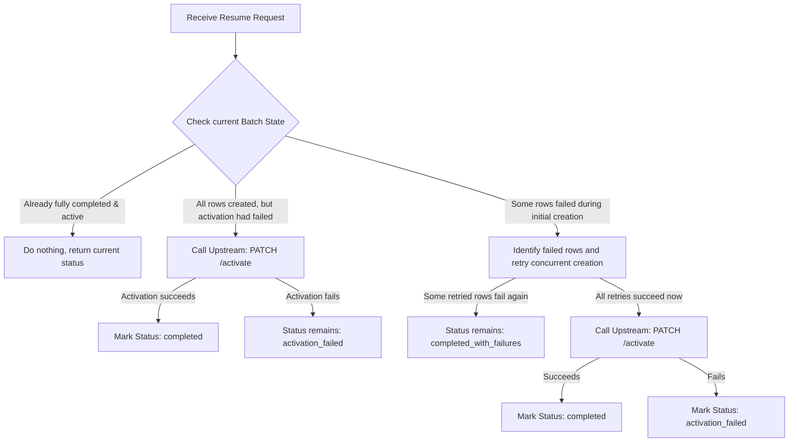
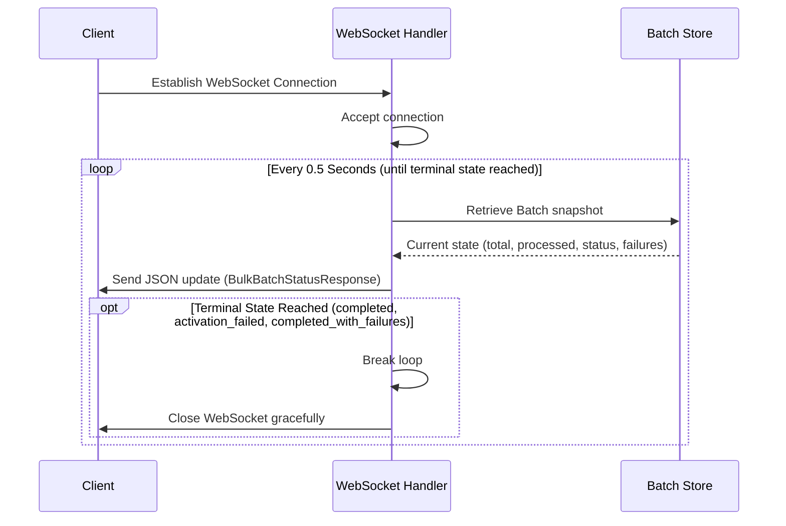
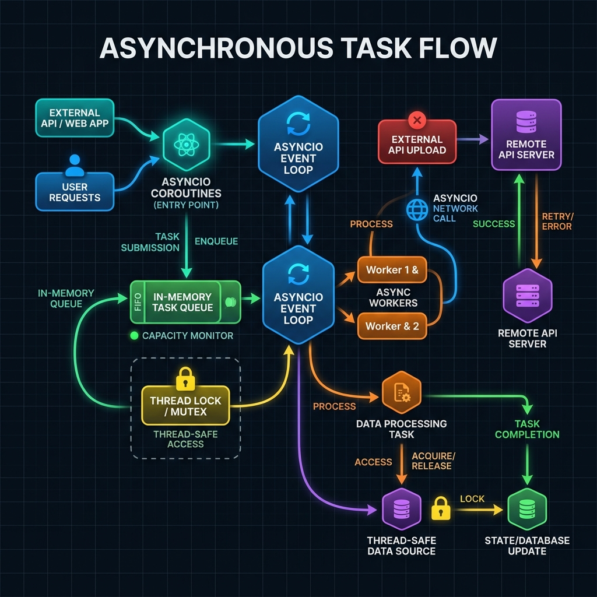
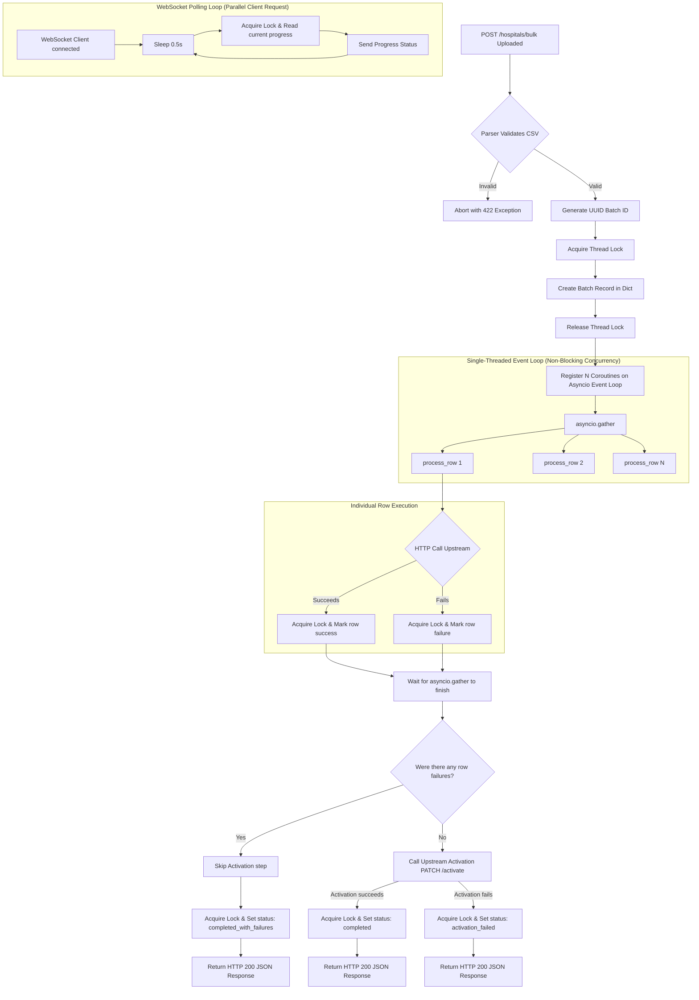

# Paribus API Scenarios & Decision Trees

This document maps out every possible system execution path, request flow, validation rule, error boundary, and recovery state for the Paribus Bulk Processing Service. It shows exactly how your local service coordinates with the upstream Hospital Directory API.

---

## 1. Global API Workflow Decision Tree

The following diagram illustrates the lifecycle of a CSV upload request, tracing its progression through validation, concurrent creation, and upstream batch activation.

---

## 2. In-Depth Scenario Breakdown

### Scenario 1: CSV Syntax & Schema Validation
* **Endpoint:** `POST /hospitals/bulk/validate` or standard upload at `POST /hospitals/bulk`
* **Workflow:** parses the file in memory without hitting any external resources.

| Input Scenario | Expected Outcome | HTTP Status | Response Payload Example |
| :--- | :--- | :--- | :--- |
| **Empty File** | Rejection | `422` | `{"detail": "The uploaded CSV file is empty."}` |
| **File too large (>1MB)** | Rejection | `422` | `{"detail": "The uploaded file exceeds the maximum size of 1048576 bytes."}` |
| **Missing required headers** (e.g. `address` missing) | Rejection | `422` | `{"detail": "The CSV file is missing required headers: address."}` |
| **Unsupported headers** (e.g. `fax_number` present) | Rejection | `422` | `{"detail": "The CSV file contains unsupported headers: fax_number."}` |
| **Duplicate headers** (e.g. `name,name,address`) | Rejection | `422` | `{"detail": "Duplicate CSV header detected: name."}` |
| **Row count exceeds limit (>20)** | Rejection | `422` | `{"detail": "The CSV file contains 25 hospitals, but the maximum allowed is 20."}` |
| **Empty name/address values on row** | Rejection | `422` | `{"detail": "Row 2: 'name' is required."}` |
| **Valid CSV** | Success | `200` | `{"valid": true, "total_hospitals": 3, "preview": [...], "errors": []}` |

---

### Scenario 2: Processing and Concurrency (`POST /hospitals/bulk`)
* **Endpoint:** `POST /hospitals/bulk`
* **Trigger:** A structurally valid CSV is received.

#### Decision Logic Post-Ingestion:
1. **Case A: 100% Row Success:**
   * Trigger upstream patch: `PATCH /hospitals/batch/{batch_id}/activate`
   * **If activation succeeds:** Set status to `completed` and mark all rows `created_and_activated`.
   * **If activation fails:** Set status to `activation_failed` (retains local success records, but marked inactive).
2. **Case B: Partial/Total Row Failure:**
   * **Skip Activation** immediately (keeps successful records safely isolated as inactive in upstream db).
   * Set status to `completed_with_failures` (contains exact failure diagnostics per row).

---

### Scenario 3: Resuming Operations (`POST /hospitals/bulk/{batch_id}/resume`)
* **Endpoint:** `POST /hospitals/bulk/{batch_id}/resume`
* **Trigger:** The client requests recovery of a previously failed batch.

---

### Scenario 4: Real-time Client Streaming (`WS /hospitals/bulk/{batch_id}/ws`)
* **Endpoint:** `/hospitals/bulk/{batch_id}/ws`
* **Trigger:** The client opens a WebSocket connection to monitor execution real-time.

---

## 3. Concurrency, Thread-Safety & Memory Queue Model

Here is a high-resolution, premium visual diagram detailing the asynchronous execution flow, thread locking, and event queue:

The diagram below details the step-by-step decision and execution flow when a request enters the application, showing how thread-locks, async micro-tasks, and the in-memory state dict coordinate.

